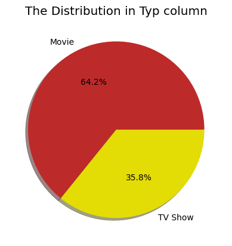
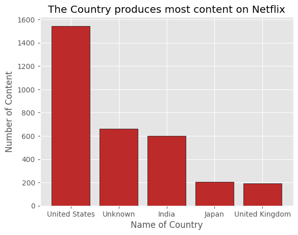
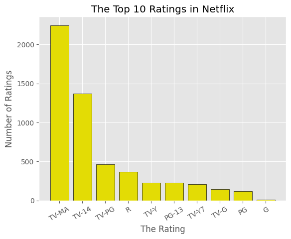
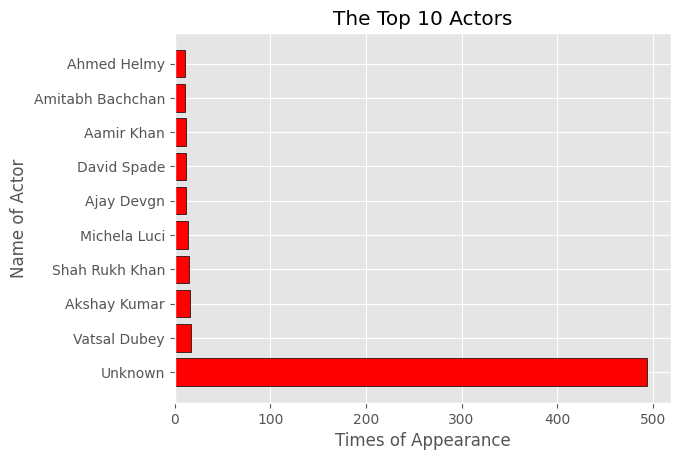
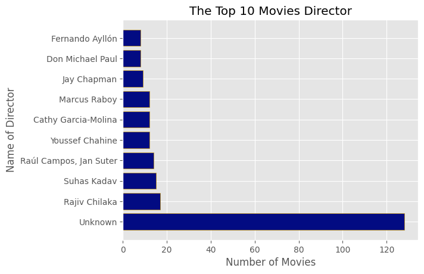

# 🎬 Netflix Data Cleaning & Analysis

## 📊 Project Overview
This project involves comprehensive data cleaning and exploratory data analysis (EDA) of the **Netflix Movies and TV Shows** dataset. The analysis aims to uncover significant trends in content strategy, global production, and audience preferences by transforming raw data into structured insights.

---

## 📂 Dataset Source
This analysis utilizes the **Netflix Movies and TV Shows Dataset** from **Kaggle**:
🔗 [Netflix Dataset on Kaggle](https://www.kaggle.com/datasets/shivamb/netflix-shows)

---

## 🔍 Key Insights & Visualizations

### 1. Content Strategy: Movies vs. TV Shows
Netflix's library shows a clear preference for cinematic content. Our analysis of **5,397** records reveals that approximately **64.2%** of total titles are **Movies**, while **35.8%** are **TV Shows**.
 
 |.             *Technologies Used: Matplotlib* 

---

### 2. Global Production Hubs
While Netflix content is global, production is concentrated in key markets.

*   **Key Findings:**
    1.  **United States:** Leads with over **2,000+** titles.
    2.  **India:** A major contributor, reflecting investment in regional cinema.
    3.  **United Kingdom:** The third-largest producer of international content.

*Technologies Used: Matplotlib*

---

### 3. Content Evolution & Growth Trends
The platform experienced significant growth in content additions, particularly from **2016** to **2020**.

---

### 4. Audience Targeting & Ratings
The rating distribution indicates a focus on mature audiences.

*   **Observation:** **TV-MA** (Mature Audiences) and **TV-14** are the most frequent ratings.

*Technologies Used: Matplotlib*

---

### 5. Talent & Creative Leadership
Identifying the most prolific contributors to the Netflix catalog.

| Top 10 Actors | Top 10 Directors |
| :---: | :---: |
|  |  |
| *Technologies Used: Matplotlib* | *Technologies Used: Matplotlib* |

---

## 💡 Conclusion
This analysis highlights Netflix's strategic focus on **Movies** and its reliance on **U.S. and Indian markets**. The data cleaning process ensured accurate representation of the platform's library, providing valuable insights into content trends and audience engagement.
