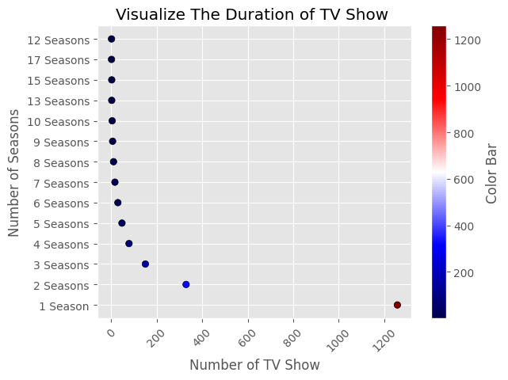

# 🎬 Netflix Data Cleaning & Analysis

## 📊 Project Overview
This project focuses on the comprehensive cleaning and exploratory data analysis (EDA) of the **Netflix Movies and TV Shows** dataset. By transforming raw, messy data into structured insights, this analysis uncovers significant trends in content strategy, global production hubs, and audience preferences.

---

## 📂 Dataset Source
The analysis is based on the **Netflix Movies and TV Shows Dataset** from **Kaggle**:
🔗 [Netflix Dataset on Kaggle](https://www.kaggle.com/datasets/shivamb/netflix-shows)

---

## 🔍 Key Insights & Visualizations

### 1. Content Strategy: Movies vs. TV Shows
Netflix's library is heavily weighted towards cinematic content. Our analysis of **5,397** records reveals a clear preference for full-length features.

*   **Insight:** Approximately **69.6%** of total titles are **Movies**, while **30.4%** are **TV Shows**.
*   **Visualization:** The following charts illustrate this dominant trend in content acquisition.

| Type Distribution (Count) | Percentage Breakdown |
| :---: | :---: |
|  |  |
| *Movies lead by a significant margin in total volume.* | *Visualizing the 7:3 ratio between Movies and Shows.* |

---

### 2. Global Production Hubs
Netflix content is a global phenomenon, but production remains concentrated in a few key markets.

*   **Key Findings:**
    1.  **United States:** The undisputed leader with over **2,000+** titles.
    2.  **India:** A massive contributor, reflecting Netflix's investment in regional cinema.
    3.  **United Kingdom:** The third-largest producer, providing high-quality international content.
*   **Visualization:** This ranking highlights the geographic diversity of the platform.

*Caption: The U.S. and India dominate the platform's production landscape.*

---

### 3. Content Evolution & Growth Trends
The platform experienced an exponential surge in content additions over the last decade, particularly during the late 2010s.

*   **Trend Analysis:** A massive spike in additions started in **2016**, reaching its peak between **2019 and 2020**.
*   **Release Cycle:** Most titles added recently were produced between **2017 and 2021**, showing Netflix's focus on fresh, contemporary content.

| Addition Trends Over Time | Release Year Distribution |
| :---: | :---: |
|  |  |
| *The rapid expansion of the Netflix library since 2016.* | *Focusing on the 2017-2021 contemporary release window.* |

---

### 4. Audience Targeting & Ratings
Understanding the target demographic is crucial. The rating distribution shows a lean towards mature audiences.

*   **Observation:** **TV-MA** (Mature Audiences) is the most frequent rating, followed by **TV-14**, indicating a content strategy aimed at adults and older teens.
*   **Visualization:** Distribution of content across different age-appropriateness categories.

*Caption: TV-MA and TV-14 represent the largest segments of the Netflix library.*

---

### 5. Talent & Creative Leadership
We also identified the most prolific contributors to the Netflix catalog.

*   **Most Prolific Actors:** The analysis tracks actors with the highest frequency of appearances (e.g., Bollywood stars like **Anupam Kher** and **Shah Rukh Khan**).
*   **Top Directors:** Identifying the visionaries behind the most titles.

| Top 10 Actors | Top 10 Directors |
| :---: | :---: |
|  |  |
| *Highlighting the most frequent faces on the platform.* | *The directors responsible for the largest volume of content.* |

---

## 🛠️ Tech Stack
*   **Language:** Python (Pandas, NumPy)
*   **Visualization:** Matplotlib, Seaborn
*   **Environment:** Jupyter Notebook

---

## 💡 Conclusion
The analysis demonstrates Netflix's strategic shift towards **Movies** and its heavy reliance on **U.S. and Indian markets**. The data cleaning process ensured that missing values (especially in Director and Cast columns) were handled rigorously to provide an accurate representation of the platform's library.
